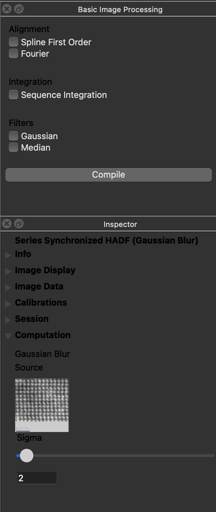
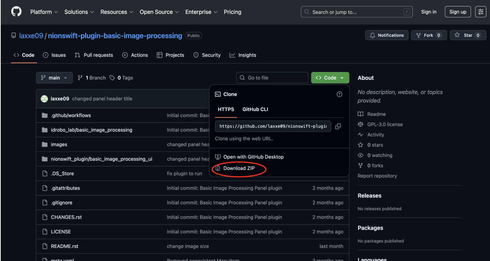
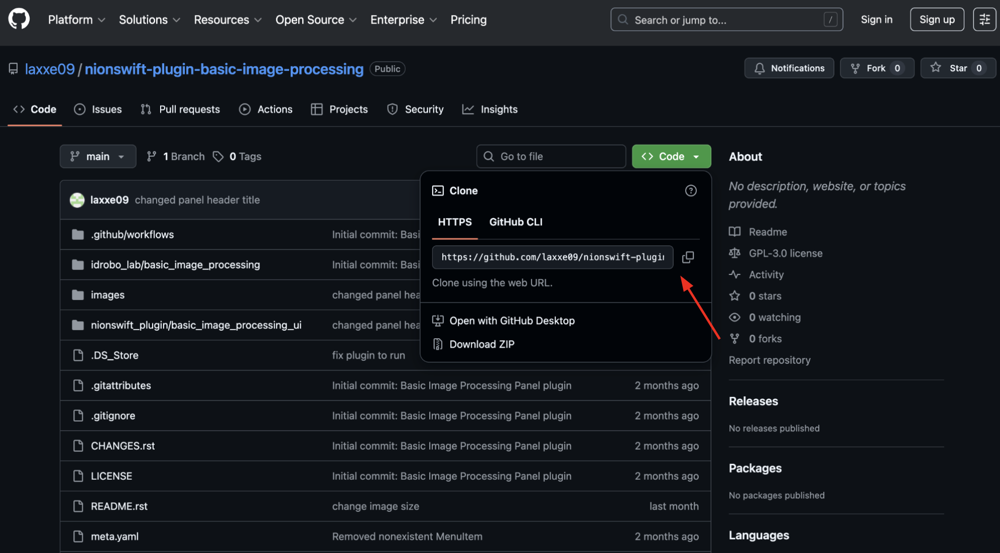
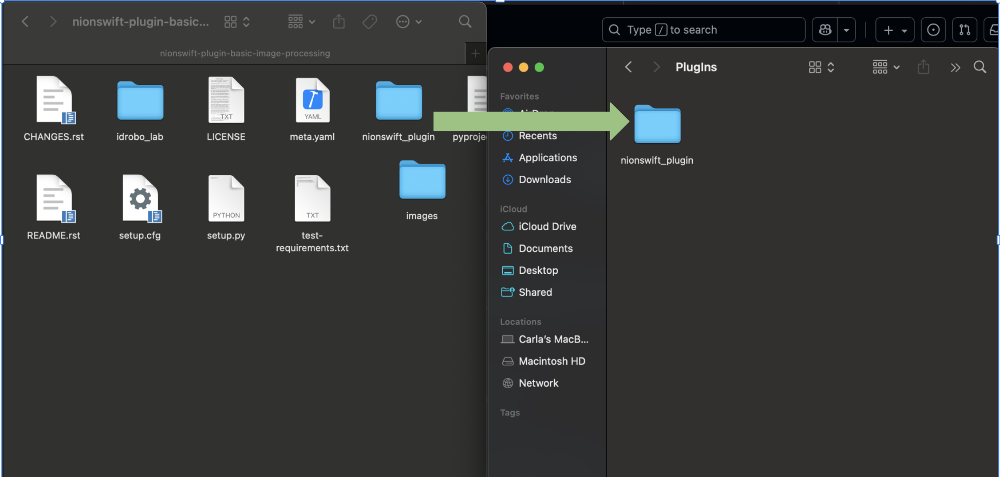

Basic Image Processing Panel
======================

by Carla Acosta (Idrobo Lab)

A Nion Swift plug-in for Processing (used in Nion Swift)
--------------------------------------------------------
This plugin adds a Basic Image Processing Panel to Nion Swift that streamlines commonly used image processing tasks.

Overview

The panel provides checkboxes for quick access to:
	•	Align
	•	Integrate
	•	Gaussian Filter
	•	Median Filter

Once the desired operations are selected, users can click the Compile button to apply them in sequence as a single processing pipeline.

Inspector Panel Integration

Below the Basic Image Processing Panel, the Inspector Panel can be used to adjust computation parameters.

This plugin works best when the Inspector Panel (found under the Window menu) is open, allowing real-time adjustment of Gaussian sigma values.

Installation Steps

Step 1: Downloading the files

Option 1: Download zip file 

   
Option 2: Clone repository into preferred directory / folder

   •	Open Terminal / Command Prompt
   •	cd to easily accessible folder (e.g. "cd Desktop")
   •	git clone <repo url>

Step 2: Locate the Nion Swift PlugIns folder: 

On MacOS: 
   •	Go to Finder
   •	Cmd + Shift + G
   •	~/Library/Application Support/Nion/Nion Swift/PlugIns
On Windows: 
   •	Go to Windows search bar
   •	C:\Users\<YourUsername>\AppData\Roaming\Nion\Nion Swift\PlugIns 

   ** Make sure to replace <YourUsername>
   
Step 3: Move the nionswift_plugin file to the PlugIns folder: 
 
Take the nionswift_plugin file within the downloaded file from Step 1 and move it to the PlugIns folder. 

Final Step: Run Nion Swift 

.. start-badges

.. list-table::
    :stub-columns: 1

    * - package
      - |version|

.. |version| image:: https://img.shields.io/pypi/v/idrobo-lab-nionswift-plugin-basic-image-processing.svg
   :target: https://pypi.org/project/idrobo-lab-nionswift-plugin-basic-image-processing/
   :alt: Latest PyPI version

.. end-badges

More Information
----------------

- `Changelog <https://github.com/idrobo-lab/nionswift-plugin-basic-image-processing/blob/master/CHANGES.rst>`_

